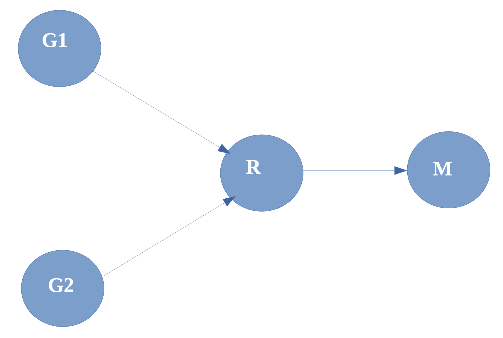

Advanced and Robot Programming](https://corsi.unige.it/en/off.f/2022/ins/60228?codcla=10635)<br>
**Programmer:** [Ankur Kohli](https://github.com/ankurkohli007)<br>
[M.Sc Robotics Engineering](https://corsi.unige.it/corsi/10635)<br>
[University of Genoa (UniGe)](https://unige.it/en)<br>
**Supervisor:** [Prof. Renato Ugo Raffaele Zaccaria](https://rubrica.unige.it/personale/VUFOXVhs) & [Prof. Simone Macciò](https://rubrica.unige.it/personale/UUNAWFho)

This second assignment of course Advance and Robot Programming and it deals with the two process **G1** & **G2**, which will communicate with **R** process using **named pipe** and **unnamed pipe** aprroach as well. Later, this **R** process will communicate with **M** process through both **named pipe** and **unnamed pipe**.

Figure below shows the architecture the proposed assignment. 


**G1**, **G2** are processes that generate short messages composed by a time stamp, the process identifier, and a little datum identifying the message itself:

```c
struct message {time_t timestamp; char g; int x);
```

***timestamp*** is the actual time (by a suitable syscall); <br>
***g*** is a character identifying G1 or G2; <br>
***x*** is the sequence number of the message by G1 or G2. <br>

Any message is generated by Gi inside a **strict loop** (the fastest possible); at any cycle a delay is applied before sending the message. The delay is computed as follows:


```
delay [microseconds] = offset + random(0,offset);
```
where, <br>

***random(0,offset)*** is a random generator in the interval 0 – offset with uniform probability; <br>
***offset*** is a parameter that must be changed in the experiment. <br>

This is simplified model simulates the generation of quasi-periodic messages by a sensor at variable rate (depending on the value of offset).

**R** is a non deterministic receiver of the messages, with the aim of receiving as many messages as possible without blocking the generators Gi. R puts in a queue all received messages, in the same order they are received, adding each the actual time of reception. After the run is terminated (at least 1 million cycles of either G1 or G2), R transfers them to M; M computes the *bandwidth*. 

**M** analyzes data and outputs the result of the form: 

no. of G1|G2 cycles: xx <br>
no. of messages received: xx <br>
offset delay in G1 | G2 cycles (usec): xx <br>
average delay (latency) between generation and reception of messages (usec): xx estimated bandwidth between G and R (bit/s): xx <br>

Communication between Gi and R, and R and M are made through **pipes (*)**.

(*) write your program in two versions: 1. two unnamed pipes between Gi and R 2. one named pipe between Gi and R


